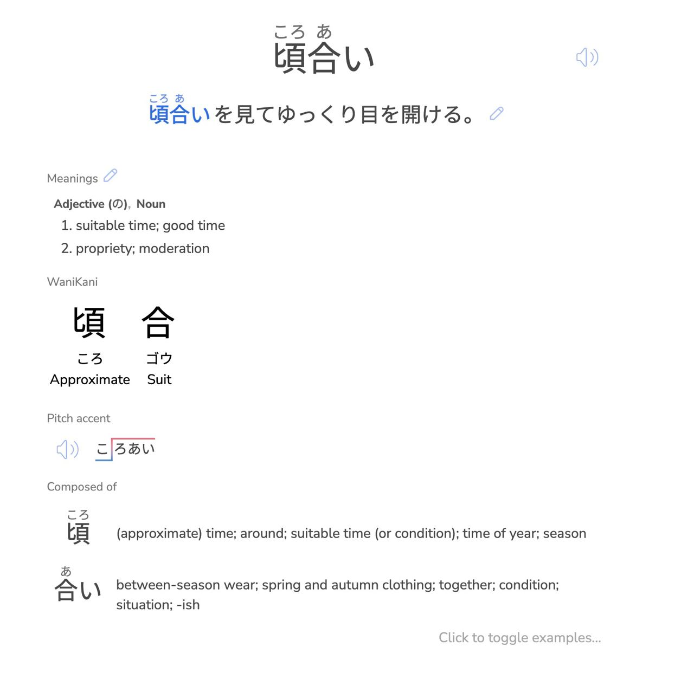

# jpdb-wanikani-reference

Basic imlementation that allow to add refrences to wanikani kanji to jpdb review/voculabrary pages.

Click by kanji in "Wanikani" section open kanji page at [wanikani.com](https://www.wanikani.com/).



# installations

Add [jbpd_wanikani_reference.js](https://github.com/dancing-elf/jpdb-wanikani-reference/blob/main/jbpd_wanikani_reference.js) to tampermonkey.

# Part for developers
Sorry for such awfull code :( But it works and now it is more than enough for me.

For simplicity kanji data are hardcoded in the script. 
If you want to participate you may want to regenerate this data.
To regenrate it you can do steps bellow.
1) Get data from wanikani with curl (maybe check page_after_id)
```
curl "https://api.wanikani.com/v2/subjects?types=kanji" \
-H "Authorization: Bearer WANIKANI_TOKEN" > k1.json

curl "https://api.wanikani.com/v2/subjects?types=kanji&page_after_id=1439" \
-H "Authorization: Bearer WANIKANI_TOKEN" > k2.json

curl "https://api.wanikani.com/v2/subjects?types=kanji&page_after_id=2439" \
-H "Authorization: Bearer WANIKANI_TOKEN" > k3.json
```
2) Generate json structure for using in script with [prepare_kanji_map.js](https://github.com/dancing-elf/jpdb-wanikani-reference/blob/main/prepare_kanji_map.js)

